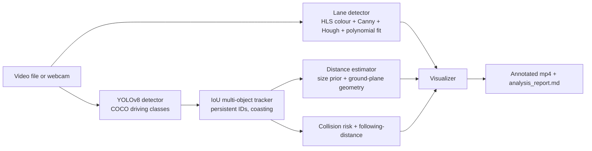

# AV Perception Pipeline

Monocular dashcam perception in Python: YOLOv8 detection, IoU-based multi-object tracking with persistent IDs, classical lane detection, size/perspective distance estimation, and a heuristic collision-risk score, rendered onto an annotated video.

> Repository name: `sadeeqgandalf-autonomous-vehicle-Perception`. "AV Perception Pipeline" is the suggested display title.



## What it does

- Detects persons, bicycles, cars, motorcycles, buses, trucks, traffic lights and stop signs with a pretrained YOLOv8 model (default `yolov8m.pt`, confidence 0.5).
- Tracks detections across frames with persistent track IDs, per-track velocity, short trajectory history and linear position prediction.
- Detects left/right lane lines with classical computer vision and temporal smoothing over the last 5 frames.
- Estimates distance to each tracked object from a single camera, using class size priors and a flat-ground perspective model with assumed camera parameters (not calibrated).
- Scores per-track collision risk (LOW / MEDIUM / HIGH / CRITICAL) and a lead-vehicle following-time status, and logs HIGH/CRITICAL events.
- Writes an annotated video and a Markdown analysis report; includes a Streamlit demo and a YOLOv8 model benchmark utility.

## Pipeline

Entry point: `src/pipeline_pro.py` (`PerceptionPipelinePro`). Per frame:

1. `detector.py` runs YOLOv8 and keeps only the driving classes above.
2. `tracker.py` (`MultiObjectTracker`) matches detections to tracks and confirms a track after 3 hits.
3. `lane_detector.py` finds lane lines in the lower region of the frame.
4. `distance_estimator.py` attaches a distance estimate (metres) to each confirmed track.
5. `tracker.py` (`CollisionRiskAssessor`) combines box area, approach rate, lane offset and a pixel-space time-to-collision into a risk score; `FollowingDistanceAnalyzer` converts the lead-vehicle distance into a following time using an assumed ego speed (15 m/s by default; no real speed input).
6. `visualizer_pro.py` draws tracks, lanes, risk colours and an info panel; `metrics.py` records FPS and latency.

## Tech stack

Python, PyTorch, Ultralytics YOLOv8, OpenCV, NumPy, tqdm, Streamlit (demo app). `requirements.txt` also lists pandas, scipy, matplotlib, seaborn, plotly, Jupyter and imageio.

## Quick start

No Python version is pinned in the repo; use a Python 3 version supported by your installed PyTorch and Ultralytics.

```bash
git clone https://github.com/sadeeqgandalf/sadeeqgandalf-autonomous-vehicle-Perception.git
cd sadeeqgandalf-autonomous-vehicle-Perception
python -m venv venv && source venv/bin/activate
pip install -r requirements.txt

# Run on a video (the scripts in src/ use flat imports, so run from src/)
cd src
python pipeline_pro.py --input "../data/your_video.mp4" --output "../outputs/" --no-preview
```

Arguments for `pipeline_pro.py`: `--input/-i` (video path or camera index such as `0`, required), `--output/-o` (default `outputs/`), `--model/-m` (default `yolov8m.pt`, auto-downloaded by Ultralytics on first use), `--confidence/-c` (default 0.5), `--no-preview`, `--max-frames`. With the preview window open, `q` quits, `p` pauses and `s` saves a screenshot.

Outputs go to the output directory: `pro_<input name>.mp4` (annotated video) and `analysis_report.md` (FPS, latency, object counts, unique tracks, first 20 high-risk events). `outputs/`, `*.mp4`, and model weights (`*.pt`) are git-ignored.

Other entry points:

- `python pipeline.py --input video.mp4` (in `src/`): the earlier detection + lane pipeline without tracking; also accepts `--image`.
- `streamlit run app.py` (repo root): upload-and-inspect demo. If the models fail to load it falls back to mock detections.
- `python setup_and_test.py` (repo root): dependency check and a synthetic test video.
- `python src/model_benchmark.py`: benchmarks YOLOv8 variants on generated test images.
- `notebooks/01_understanding_the_basics.ipynb`: introductory notebook.

Note: if `ultralytics` is not importable, `ObjectDetector` prints a warning and returns hard-coded mock detections, so output in that case is not real perception.

## Project structure

```
app.py                     Streamlit demo
src/
  detector.py              YOLOv8 wrapper (driving classes)
  tracker.py               MultiObjectTracker, Track, CollisionRiskAssessor
  lane_detector.py         Classical lane detection
  distance_estimator.py    Monocular distance + following-distance analysis
  pipeline_pro.py          Main pipeline and CLI (tracking, distance, risk)
  pipeline.py              Basic pipeline (detection + lanes)
  visualizer_pro.py        Overlays for the main pipeline
  metrics.py               FPS / latency tracking
  model_benchmark.py       YOLOv8 variant benchmark
notebooks/                 Intro notebook
data/BDDA/                 BDD-A GPS metadata (JSON) only; no videos or images
download_sample_data.py, process_bdd_samples.py, setup_and_test.py
```

## Results

Not yet reported. The repository contains no demo video, screenshots, evaluation outputs or benchmark results, so no accuracy, mAP or FPS figures are claimed here. (Earlier versions of this README quoted FPS and mAP numbers; no script or output in the repo produces them.)

To produce real numbers:

- Throughput and latency: run `pipeline_pro.py` on a clip and read the printed metrics summary and `analysis_report.md` (Average FPS, Average Latency). Record the hardware and model used.
- Detector comparison: run `python src/model_benchmark.py` for YOLOv8 variant speed on this machine.
- Tracking quality (IDF1, ID switches) and distance error need labelled ground truth, which is not included; evaluating them on an annotated driving set such as BDD100K or KITTI is the open step.

## Occlusion and tracking

What the tracker does (`src/tracker.py`):

- Greedy IoU association between existing tracks and new detections (IoU threshold 0.3), restricted to the same class.
- When a track has no matching detection it is kept alive for up to `max_age=30` frames and its box is coasted forward at the last measured pixel velocity. A briefly occluded object can therefore keep its ID if it reappears near the predicted box.
- Tracks are only reported after `min_hits=3` detections, which suppresses one-frame false positives.

Limitations and next steps:

- Despite the module docstring, this is not ByteTrack: there is no second association pass for low-confidence detections, no Kalman filter (constant-velocity extrapolation only) and no appearance re-identification. IDs can switch after long occlusions or when objects cross.
- Distance uses assumed camera parameters (focal length 500 px, 1.2 m height) and class size priors; treat values as rough.
- The risk score and time-to-collision are heuristics in pixel space, not physical TTC, and ego speed is assumed.
- Next steps: Kalman filtering, two-stage low-confidence association, appearance embeddings, camera calibration, and quantitative evaluation with MOT metrics.

## Credits and licences

- [Ultralytics YOLOv8](https://github.com/ultralytics/ultralytics) with pretrained COCO weights, downloaded at run time (not stored in this repo). Ultralytics is released under AGPL-3.0 with a separate enterprise licence; check their terms before commercial use.
- BDD-A (Berkeley DeepDrive Attention) GPS metadata in `data/BDDA/`. Its licence is not stated in this repo; refer to the dataset's own terms.
- This repository has no LICENSE file.

## Related work

Occlusion-aware multi-object tracking: [lunar-occlusion-tracking](https://github.com/sadeeqgandalf/lunar-occlusion-tracking). SAM3 MOTS experiments: [ComputerVision_Research](https://github.com/sadeeqgandalf/ComputerVision_Research).
